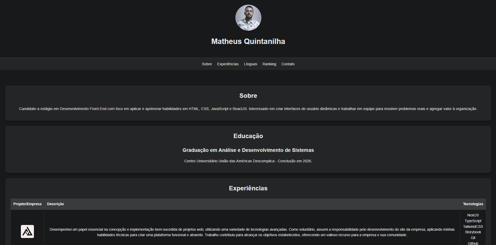

# Portfólio Pessoal de Matheus Quintanilha

Este é o repositório do código-fonte do meu portfólio pessoal, desenvolvido usando HTML e CSS. Este projeto foi desenvolvido como parte das aulas oferecidas pelo curso da Ada e Santander, aplicando os conceitos aprendidos até agora.

## Tecnologias Utilizadas

O portfólio foi desenvolvido usando as seguintes tecnologias:

- **HTML**
- **CSS**

## Como visualizar

Para visualizar o portfólio, basta acessar [https://personal-portfolio-matheus-ada-santander.vercel.app/](https://personal-portfolio-matheus-ada-santander.vercel.app/) em seu navegador da web.

## Como contribuir

Contribuições são bem-vindas! Se você tiver sugestões de melhorias, correções de bugs ou novos recursos, sinta-se à vontade para abrir uma issue ou enviar um pull request.

## Licença

Este projeto está licenciado sob a Licença MIT. Consulte o arquivo [LICENSE](LICENSE) para obter mais detalhes.

